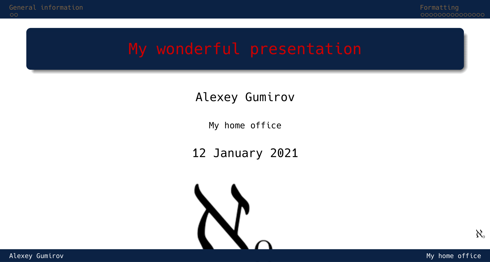
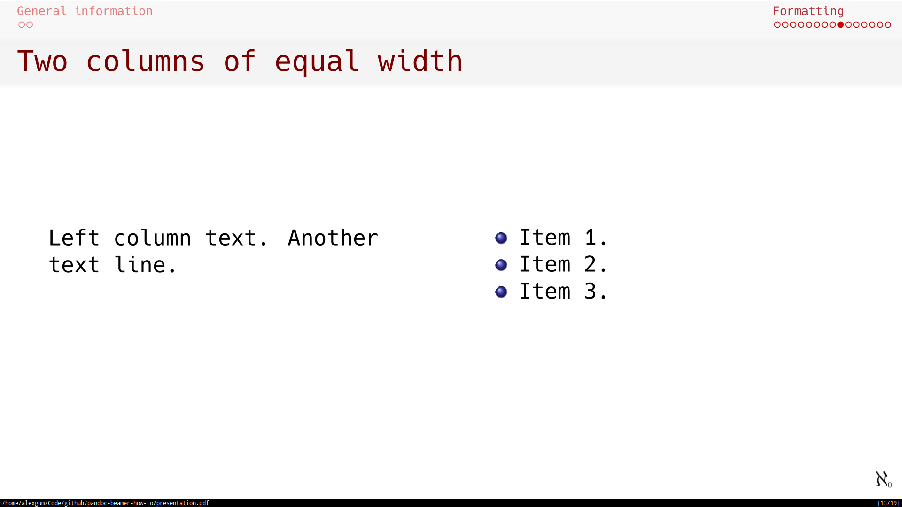
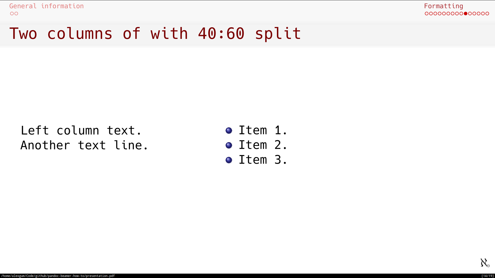
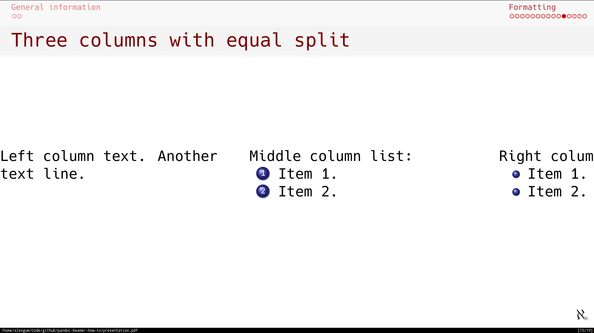
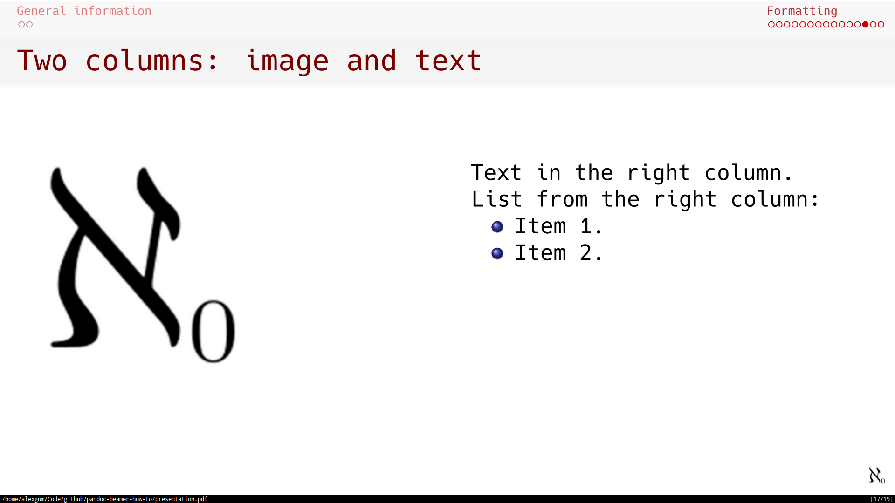
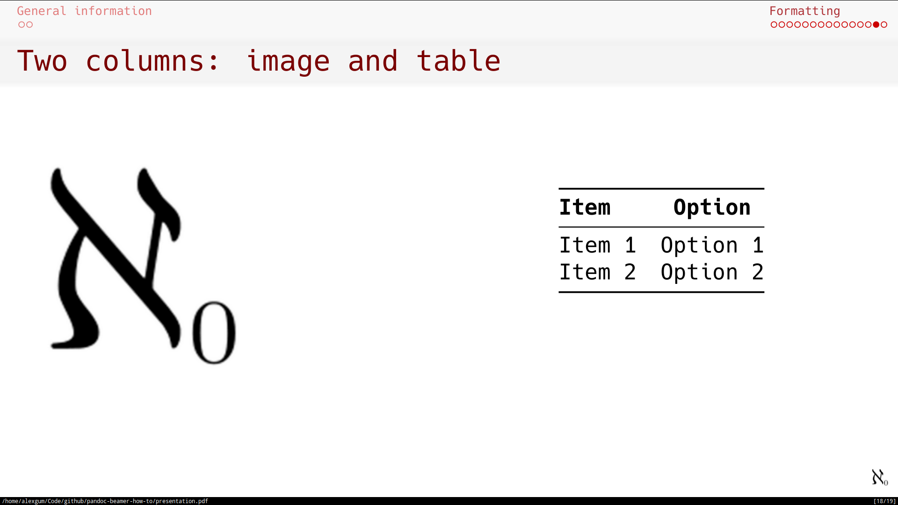
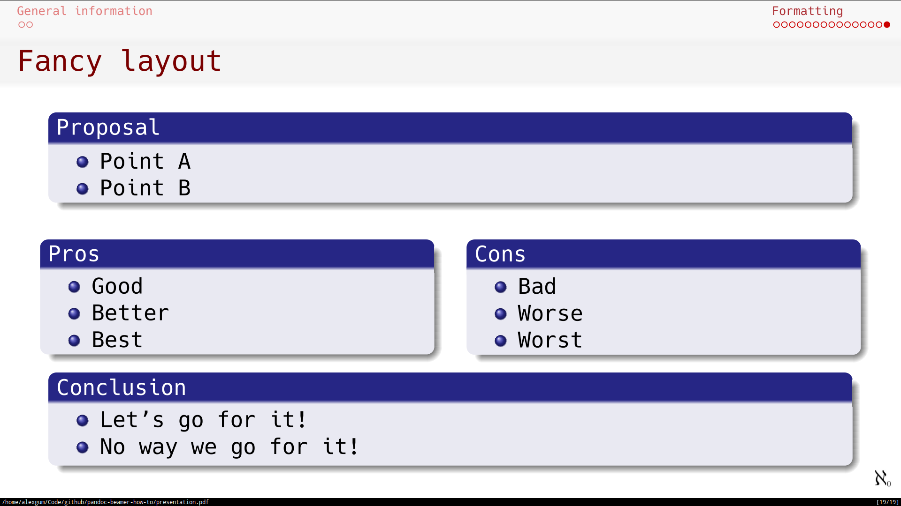

# Making presentations with Pandoc beamer

This is a short guide about how I make PDF slides using **beamer** format output from the **pandoc**.

**Update**: Changes from `xelatex` to `lualatex`.
> I had issues with PDF creation using `xelatex` engine which I could not fix. My script worked on my home Manjaro Linux, but did not work on Ubuntu 20.04 with my corporate setup. 
> After some troubleshooting I changed pdf engine to `lualatex` and things went back to normal.
> `lualatex` engine is slower, than `xelatex`, but it gives better output.

> Note: Commands are updated for the latest Pandoc version: `2.10.x` and newer.


## How-to for docs preparation

### Tools

- **pandoc**

	- template: I use my own modified template in order to produce nicer looking listings of code. This template you can download [here](pandoc/templates/default_mod.latex).

	- Matrix of beamer themes: [https://hartwork.org/beamer-theme-matrix/](https://hartwork.org/beamer-theme-matrix/)

	- Font themes: [https://deic-web.uab.cat/~iblanes/beamer_gallery/index_by_font.html](https://deic-web.uab.cat/~iblanes/beamer_gallery/index_by_font.html)

- **texlive**
- **convert**

    - converts and formats images.
    - it is used here for the change of DPI of the images and convert to PNG.
    - **convert** is the utility which is part of the **ImageMagick** package.

I did not install **convert** tool, it seems like it is installed by default in Ubuntu or comes with **texlive**.
To avoid possible issues with **pdflatex** engine I did full installation of **texlive** packet.

In Debian family (with **apt**):

```sh
sudo apt-get update
sudo apt-get install pandoc
sudo apt-get install imagemagick
```

> `apt` will install pretty old version of Pandoc and some features will be missing. If you want latest version of this application, download latest package for your system from the project page: [https://github.com/jgm/pandoc/releases](https://github.com/jgm/pandoc/releases).
I use following `texlive` packages:

```sh
sudo apt-get install texlive-latex-recommended
sudo apt-get install texlive-fonts-recommended
sudo apt-get install texlive-latex-extra
sudo apt-get install texlive-fonts-extra
sudo apt-get install texlive-xetex
```
I recommend to use Pandoc of **2.10.x** or newer version for the creation of presentation because not all beamer features are supported in the Pandoc 1.x.

### Instructions and commands

#### YAML Block for LaTex template

This YAML block in the beginning of the MarkDown file defines parameters used by the Pandoc engine and relevant LaTex template parameters. This particular example below instructs Pandoc to produce PDF slides file with particular theme, color theme, etc.

```yaml
title: "My wonderful presentation"
author: "Alexey Gumirov"
institute: "My home office"
topic: "Pandoc how-to"
theme: "Frankfurt"
colortheme: "beaver"
fonttheme: "professionalfonts"
mainfont: "Hack Nerd Font"
fontsize: 10pt
urlcolor: red
linkstyle: bold
aspectratio: 169
titlegraphic: img/aleph0.png
logo: img/aleph0-small.png
date:
lang: en-US
section-titles: false
toc: true
```

This YAML block is inserted in the beginning of the markdown file.

The font I use for presentation (Hack Nerd Font) you can get on the [nerdfonts.com](https://nerdfonts.com) page.

#### Images preparation

The same way as in [my pandoc for PDF project](https://github.com/alexeygumirov/pandoc-for-pdf-how-to#images-preparation)

#### Pandoc command

> All Pandoc commands are for the Pandoc version 2.x.

> Since version 2.11 Pandoc warns that source format `markdown_github` is deprecated.
> For my formatting following replacement works:
>
> `markdown_github` ⇒
>
> ```sh
> markdown_strict+pipe_tables+backtick_code_blocks+auto_identifiers+strikeout
> ```
> Below all scripts are given with the new `markdown_strict` source format.

```sh
#!/usr/bin/sh

DATE_COVER=$(date "+%d %B %Y")

SOURCE_FORMAT="markdown_strict\
+pipe_tables\
+backtick_code_blocks\
+auto_identifiers\
+strikeout\
+yaml_metadata_block\
+implicit_figures\
+all_symbols_escapable\
+link_attributes\
+smart\
+fenced_divs"

pandoc -s --dpi=300 --slide-level 2 --toc --listings --shift-heading-level=0 --columns=50 --template default_mod.latex --pdf-engine lualatex -f "$SOURCE_FORMAT" -M date="$DATE_COVER" -V classoption:aspectratio=169 -V lang=en-US -t beamer presentation.md -o presentation.pdf
```

> **--pdf-engine**: It is important to mention, that if you want to use True Type fonts in presentation (which you put in the «mainfont»), the «lualatex» engine for PDF generation must be used.

> **default_mod.latex**: This is default template which is modified by me to produce better looking listings. In the default template listings of code are not presented nicely, so I had to improve this part.

Options of the **pandoc** command mean following:

- `-s`: Standalone document.

- `-f FORMAT` or `-r FORMAT`:

    - Specify input format. `FORMAT` can be `native` (native Haskell), `json` (JSON version of native AST), `markdown` (pandoc's extended Markdown), `markdown_strict`(original  unextended  Markdown),  `markdown_phpextra` (PHP Markdown Extra), `commonmark` (CommonMark Markdown), `textile` (Textile), `rst` (reStructuredText), `html` (HTML), `docbook` (DocBook), `t2t` (txt2tags), `docx` (docx), `odt` (ODT), `epub` (EPUB), `opml` (OPML), `org` (Emacs Org mode), `mediawiki` (MediaWiki markup), `twiki` (TWiki markup), `haddock` (Haddock markup), or `latex` (LaTeX).  If `+lhs` is appended to `markdown`, `rst`, `latex`, or `html`, the input will be treated as literate Haskell source. Markdown syntax extensions can be individually enabled or disabled by appending `+EXTENSION` or `-EXTENSION` to the format name.  So, for example, `markdown_strict+footnotes+definition_lists` is strict Markdown with footnotes and definition lists enabled, and `markdown-pipe_tables+hard_line_breaks`  is  pandoc's  Markdown  without pipe tables and with hard line breaks.
    - `all_symbols_escapable`: Except inside a code block or inline code, any punctuation or space character preceded by a backslash will be treated literally, even if it would normally indicate formatting.
    - `auto_identifiers`: A heading without an explicitly specified identifier will be automatically assigned a unique identifier based on the heading text. Allows to make cross references. More information on [Pandoc documentation page](https://pandoc.org/MANUAL.html#extension-auto_identifiers).
    - `backtick_code_blocks`: In addition to standard indented code blocks, pandoc supports fenced code blocks. These begin with a row of three or more backticks (\`) and end with a row of backticks that must be at least as long as the starting row.
    - `implicit_figures`: An image with nonempty alt text, occurring by itself in a paragraph, will be rendered as a figure with a caption. The image’s alt text will be used as the caption. This extension is very useful when you need to autogenerate captions for figures in the markdown reference format like: `{ width=100% }`.
	- `link_attributes`: Allows to add addional attributes to links (to images and refernce links). For pictures we can define width and height.
    - `fenced_divs`: Allow special fenced syntax for native `Div` blocks. A `Div` starts with a fence containing at least three consecutive colons plus some attributes. The attributes may optionally be followed by another string of consecutive colons.  
    - `pipe_tables`: Table syntax identical to Github and PHP Markdown Extra Tables.
    - `smart`: Produce  typographically  correct  output,  converting  straight  quotes  to  curly  quotes, --- to em-dashes, -- to en-dashes, and ... to   ellipses.  Nonbreaking spaces are inserted after certain abbreviations, such as “Mr.” (Note: This option is  selected  automatically  when   the output format is latex or context, unless `--no-tex-ligatures` is used.  It has no effect for latex input.)
    - `strikeout`: To strikeout a section of text with a horizontal line, begin and end it with `~~`.
    - `yaml_metadata_block`: A YAML metadata block is a valid YAML object, delimited by a line of three hyphens (---) at the top and a line of three hyphens (---) or three dots (...) at the bottom. A YAML metadata block may occur anywhere in the document, but if it is not at the beginning, it must be preceded by a blank line. 

- `--toc`: `--table-of-contents`

    - Include an automatically generated table of contents (or, in the case of latex, context, docx, and rst, an instruction to create  one)  in the output document.  This option has no effect on man, docbook, docbook5, slidy, slideous, s5, or odt output.

- `--dpi`:

    - Specify the dpi (dots per inch) value for conversion from pixels to inch/centimeters and vice versa.  The **default** is **96dpi**.  Technically, the correct term would be ppi (pixels per inch).

- `--base-header-level=N`: **DEPRECATED (use _--shift-heading-level-by_ instead)**. Specify the base level for heading (default is to 1).

- `--shift-heading-level-by=N`: Shift heading levels by a positive or negative integer. For example, with `--shift-heading-level-by=-1`, level 2 headings become level 1 headings, and level 3 headings become level 2 headings. I use `--shift-heading-level-by=0` in my scripts.

- `--slide-level N`

	- Specifies that headings with the specified level create slides (for beamer, s5, slidy, slideous, dzslides). Headings above this level in the hierarchy are used to divide the slide show into sections; headings below this level create subheads within a slide. Note that content that is not contained under slide-level headings will not appear in the slide show. The default is to set the slide level based on the contents of the document.

- `-V KEY[=VAL]`: `--variable=KEY[:VAL]`

    - Set the template variable KEY to the value VAL when rendering the document in standalone mode.  This is generally  only  useful  when  the `--template`  option  is used to specify a custom template, since pandoc automatically sets the variables used in the default templates. If no `VAL` is specified, the key will be given the value true.
    - `lang`: one of the `KEY` parameters of `-V` which defines default document language.
	- `classoption:aspectratio=169`: produces presentation with 16:9 aspect ratio.

Additional useful options of the **pandoc** command are:

- `--listings`: It creates nice presentation of the raw code (like shell code or programming code).
- `--number-section`: Automatically creates enumerated headers. 
- `--columns`: Specify length of lines in characters. This affects text wrapping in the generated source code (see --wrap). It also affects calculation of column widths for plain text tables.
- `--default-image-extension`: If you want Pandoc to insert only one type of images, e.g. PNG, then you shall add `--default-image-extension png` in the command line.
- `Preamble` or `-H`: Pandoc lets user include a custom preamble in the generated output. If you have to use some packages in LaTeX ( not so much ), you can include it in the YAML header inside the `header-includes:` tag. For example I want to use package multicol in LaTeX, my header should look like:

    ```yaml
    header-includes:
        - \usepackage{multicol}
    ```

    Preamble in Pandoc gives you more features than just to import some packages. We can also create our own PDF template. For presentation, we can re-config the Beamer theme. For example, By default, Ilmenau theme does not have slide numbers ( frame number ). So our goal now is to re-config the theme without changing the theme source code. If you are using LaTeX then it quite easy to deal with that. Either does Pandoc, instead of using header-includes tag, we can create a new file called preamble.tex - you can put all the configuration in LaTeX to this file the same way you use LaTeX to create a beamer presentation. Usage:

    ```sh
    -H preamble.tex
    ```

    > **preamble.tex**: This is default template which is modified by me to produce better colorscheme, frame number, and re-design footer, etc. In the default template of code, these features are not presented nicely, so I had to improve this part.

*Screenshot of the theme modified with `preamble.tex`*



## Columns on slides

`fenced_divs` extension allows to divide slide in columns.

### Two columns of equal width



*Code:*

```markdown
## Two columns of equal width

::: columns

:::: column

Left column text.

Another text line.

::::

:::: column

- Item 1.
- Item 2.
- Item 3.

::::

:::
```

### Two columns of with 40:60 split



*Code:*

```markdown
## Two columns of with 40:60 split

::: columns

:::: {.column width=40%}

Left column text.

Another text line.

::::

:::: {.column width=60%}

- Item 1.
- Item 2.
- Item 3.

::::

:::
```

### Three columns with equal split



*Code:*

```markdown
## Three columns with equal split

::: columns

:::: column

Left column text.

Another text line.

::::

:::: column

Middle column list:

1. Item 1.
2. Item 2.

::::

:::: column

Right column list:

- Item 1.
- Item 2.

::::

:::
```

### Three columns with 30:40:30 split


*Code:*

```markdown
## Three columns with 30:40:30 split

::: columns

:::: {.column width=30%}

Left column text.

Another text line.

::::

:::: {.column width=40%}

Middle column list:

1. Item 1.
2. Item 2.

::::

:::: {.column width=30%}

Right column list:

- Item 1.
- Item 2.

::::

:::
```

### Two columns: image and text



*Code:*

```markdown
## Two columns: image and text

::: columns

:::: column

{height=50%}

::::

:::: column

Text in the right column.  

List from the right column:

- Item 1.
- Item 2.
::::

:::
```

### Two columns: image and table



*Code:*

```markdown
## Two columns: image and table

::: columns

:::: column

{height=50%}

::::

:::: column

| **Item** | **Option** |
|:---------|:----------:|
| Item 1   | Option 1   |
| Item 2   | Option 2   |

::::

:::
```

### Fancy layout



*Code:*

```markdown
## Fancy layout

### Proposal

- Point A
- Point B

::: columns

:::: column

### Pros

- Good
- Better
- Best

::::

:::: column

### Cons

- Bad
- Worse
- Worst

::::

:::

### Conclusion

- Let's go for it!
- No way we go for it!
```

## Examples

- With this [Markdown file](presentation.md) I produce:
    - [This presentation](presentation.pdf) with the default theme (small changes only in the YAML header).
    - [Modified style presentation](presentation_nice_formatting.pdf) with the modified theme via `preamble.tex` file.
